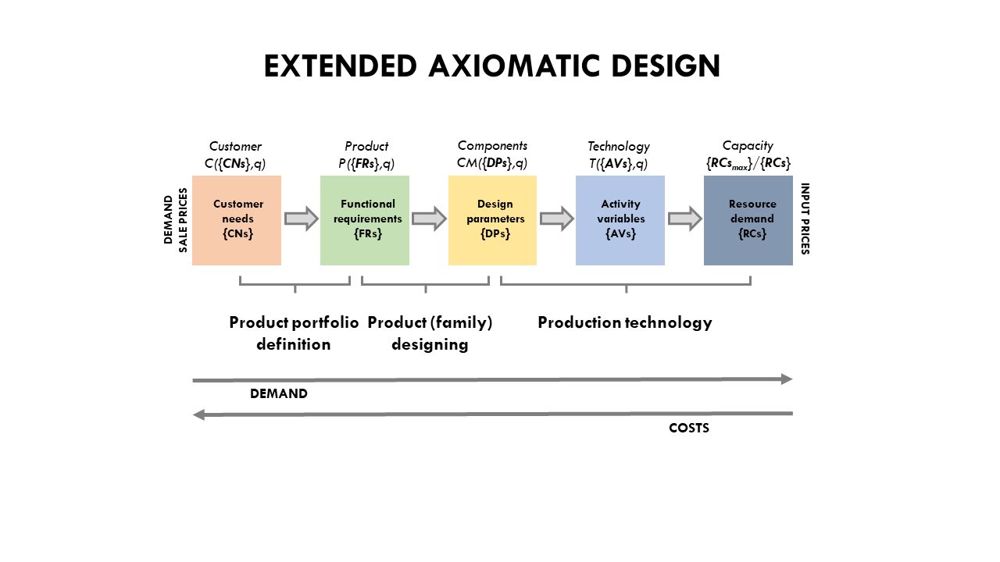

EXTENDED AXIOMATIC DESIGN
================
<<<<<<< HEAD
Kai G. Mertens
7/29/2020

=======
Kai G. Mertens, Mark Schmidt, Tugba Yildiz
30.09.2020
>>>>>>> 99f9401c3e5a782140faa74000ca212928c758e0

-----

## Overview

Extended Axiomatic Design (EAD) is a theory-integrating framework
resulting from merging of the engineering design theory and the economic
firm theory. This enhancement supports the modeling of the designs and
structures of product service programs under consideration of economic
parameters such as demand, prices, and costs. Based on axioms, the
framework attempts to explain the relationships between customer product
requirements \(**CN**\), functional characteristics \(**FR**\) and
design parameters \(**DP**\), production activities \(**AV**\) and the
corresponding resource demand \(**RC**\). Within the axiomatic modelling
matrices (Matrix Design A) are used as mapping functions. For a
hierarchical representation, the framework is differentiated into three
major submodels (product portfolio, product family design and production
technology). Each submodel corresponds to a different part of the EAD
(Figure below). The top-down product planning process is assumed for
this documentation (Krause & Gebhard, 2018; Otto et al., 2016; Ulrich &
Eppinger, 2012).

#### Product portfolio definition

The product portfolio definition devotes to the arrangement between
customers \(**C/Cs**\) and products/services \(**P**\) in the market
(external view). The EAD follows previous theory that each customer
reflects a segment consisting of several customer needs (e.g., want a
fast car, want a blue car, etc.). Marketing department differentiates
the market into segments and clusters them by their needs. This
segmentation also disentangles targetable customer segments with better
knowledge about their wishes and expectations (Du et al., 2005; Meyer &
Lehnerd, 1997; Ulrich & Ellison, 1999). To formalize the construct, EAD
uses a specific set of customer needs \(**CN**\) and realized demand
\(**q**\). The more customers overlap in their set of needs, the larger
the realized demand \(**q**\) of a segment, where firms target such
segments by providing new product variants (Du et al., 2001, 2005;
Ulrich & Ellison, 1999). The product and services \(**P**\) consists of
a specific set of functional requirements \(**FR**\) (i.e., product
specification (car with 100kW, blue car, etc.). The arrangement between
customer needs and functional requirements is described through the
design matrix \(**ACN_FR**\).

<figure align="center">

<figcaption>

Visualisation of Design Matrix \(**ACN_FR**\) for mapping
customer needs and product functions.

</figcaption>

</figure>

#### Product family designing

The product family designing particularly concerns the arrangement of
\(**FRs**\) and design parameters \(**DPs**\) (i.e., engineering metrics
such as width, length, heat resistance etc). As every product in a
portfolio is a construct of \[P(\{FRs\},q)\] `P({FRs},q)`, each **FR**
requires a specific set of design parameters **DPs**. Principally,
**DPs** are engineering and construction metrics such as the minimum
conditions, tolerances (i.e., temperature tolerance of ±0.1°), and
employee skill requirements (i.e., capable of analyzing the data) in
services. A **DP** is not necessarily a physical object. Instead, it can
be intangible such as digital knowledge or information. Importantly, a
specific set of **DPs** is a constructs itself and, thus, **DPs** can
determine components **CMs** (see similar argumentation in Baldwin &
Clark, 2000). Using components allows to adapt and connect to previous
formalism and frameworks (Du et al., 2001; Kipp, 2012; Krause & Gebhard,
2018; Martin & Ishii, 2002; Ulrich & Ellison, 1999).

##### The product-service (family) architecture

Additionally, this submodel is extended by the so-called “product family
designing” submodel, which covers the possibility to model product
architectures (i.e., mapping **FRs** to **C**).

#### Production technology

The final submodel ***production technology*** is originated in the
economic firm theory and cost modeling. Demand for **DP** intuitively
imposes processes such as procurement and indirect production
activities. The production technology reacts to the request of **CMs**
and prompts its production functions, denotes as activity variables
**AVs** to consume resources **RCs**. The classical AD entails processes
PV, too; however, they have not yet been intensively discussed or
applied. In addition, it may lack the principles of economic theory.

-----

<<<<<<< HEAD
# Code protocol
=======
# Code protocol of EAD in R

## Code Parameters

| Abbreviations |                                    |
| ------------- | ---------------------------------- |
| C             | Customer                           |
| P             | Product / Service                  |
| FR            | Functional Requirement             |
| CM            | Components                         |
| DP            | Design Parameters                  |
| PV/AV         | Processvariable / Activityvariable |
| RC            | Resource Consmption                |
| RCC           |                                    |
| q             | Demand                             |
| A             | Mapping Matrix                     |
| DENS          | Density of Matrix A                |
| Q\_VAR        | (Customer-)Demand Dispersion       |
| DIFF\_COST    | Difference Costs                   |
| RCU           | Resource Cost Unit                 |
| RCU\_VAR      | Resource Cost Unit Variation       |
| TC            | Total Costs                        |
| TQ            | Total Demand                       |
| pcb           |                                    |
| PCB           |                                    |

## Coding Structure

The code structure is composed of three levels (see Figure below). In
all three levels, various functions and scripts are performed to fulfill
specific tasks in regards to model the EAD precisely. The second figure
illustrates the four main functions and their components. The structural
coding procedure is summarized in the second figure below. In the
following sections, main and several subfunctions will be described in
detail.

### Loading \(Loading.R\) and Initialization \(INIT.R\)

First steps consist of executing the Loading and INIT scripts attached
in the EAD file. The Loading function fulfills the purpose of uploading
all necessary packages and sourcing all relevant subfunctions,
respectively. In INIT.R all modeling requirements and values (e.g. EAD
Data Frame, placeholders, input parameters, density intervals etc.) are
determined so that the model can perform simulations. In this main
function the possibility is also given to specify output,
modularization, multicore, and case study setting. The included code
lines distinguish between case study values and simulation runs for
random experiments.

### 1\_gen\_EAD.R

To find the remaining functions the folder called “scr” needs to be
selected. The function “1\_gen\_EAD” builds upon the INIT function and
includes codes to distinguish between cases and simulation runs. For
every simulation run four subfunctions 1.1\_set\_Economic\_Parameters.R,
1.2\_define\_ProductPortfolio.R, 1.3\_design\_ProductFamilies.R, and
1.4\_build\_ProductionTechnology.R are executed.

#### 1.1\_set\_Economic\_Parameters.R

This function helps to model the economical circumstances. It includes
the .set\_Demand and .set\_ResourcePrices subunctions. The first one
serves the purpose of modeling a realized demand and determining demand
variation (Q\_VAR). The other one is for building a resource cost vector
in order to calculate the final resources costs.

#### 1.2\_define\_ProductPortfolio.R

The product portfolio consists of two hidden subfunctions called
.define\_Products and .define\_MarketandCustomers. Both functions are
composite functions and include the .designmatrix function, whose
source-code is saved in the system-cache folder. It fulfills the purpose
of creating matrices to map a specific domain with its predecessor and
successor.  
The first one specifies Matrix \(**AP_FR**\), while
.define\_MarketandCustomers uses .designmatrix function to generate
\(**AC_CN**\).

#### 1.3\_design\_ProductFamilies.R

To model product architecture, the EAD offers the possibility to make
use of design\_ProductFamilies function. Calling this function creates a
matrix \(**AFR_CM**\) to map functional requirements \(FR\)
and components \(CM\). In this way, a modeling refinement of the product
family can be achieved.

#### 1.4\_build\_ProductionTechnology.R

The function in the overall gen\_EAD is
1.4\_build\_ProductionTechnology.R. Activities and resource consumption
structure is modeled by using the given production environment
understanding in the firm theory. This function comprises the
.build\_RES\_CONS\_PAT.R-function and uses a notation that is widely
known in literature. In this hidden function, firstly the components and
activities are mapped. The corresponding term for the Matrix
\(**ACM_AV**\) is “ACT\_CONS\_PAT”. And finally a mapping of
activities and resources are also achieved through
\(**AAV_RC**\).

### 2\_cal\_EAD.R

Finally, this main function is aimed at calculating the product costs.
The principle is based on the use of the RCU on the resource level and
allocates the costs over all domains, components, functions to the
individual products requested by the customers. Thus, a precise
determination of the costs is achieved with an valuated recalculation.
>>>>>>> 99f9401c3e5a782140faa74000ca212928c758e0

###### Softwareversion

% V 0.1 New resource consumption algorithm - Now the model uses highest
% intensities from the DMM for the modules. This helps that the modules
are % not cheaper than before (see Literature)

% V 0.15 Added new variable C\_DENSITY that replaces the old
C\_HETEROGENEITY % C\_DENSITY is responsible for the customer need share
across customer % C\_HETEROGENEITY is responsible for the different
requirements in th % eproduct specification

% V 0.2 Improvements in the functional requirement generation

% V 0.2 Implementation of product variant tracking . Now two excelfiles

% will generated with an aggregated and variant-related output. % V 0.3
Implementation of manufacturing costs analyses. The algorithms are

% able to differentiate between manufacturing and other costs.
(unit-level % vs. other) % V 0.4 Found a bug regarding the component
distribution. If there wasn’t % enough components, there was no
accumulation of the Design parameters. (6818) % Additionally, I add the
VARIANT\_M measures that allows to see the % unit-level costs in detail.
% V 0.5 Usage after Nelly, performing systzematic analyses for thesis.

% V 2.00 The simulation model gets a refresh of some functions and
names. % Preparing dissertation experiments.

% V 2.10 Upgrading the DSM\_Overdesign ; Increases speed and relaibility
of % reulsts; Changing clustering to determiniation; 190409 % V 2.11 New
descriptive measurements

% V 2.2 ; Bug fix\! There was the possibility that activities are not
fully % filled with non zero values. The algorithm noticed that but have
not % saved it but indirectly put in a new random number.

% V 2.3 ; Product architecture density has been included ; 25/4/19
Several % test provided evidences that solely the lower triangular makes
sence for % up- and downscaling;

% V 2.5 ; Production Environment Generation update
<<<<<<< HEAD
=======

| EAD - Submodels              | Parameters                   |
| ---------------------------- | ---------------------------- |
| Product Portfolio Definition | C, CNs, P, FRs, q            |
| Product Family Design        | FRs, CMs, DPs,               |
| Production Technology        | DPs, CMs, AVs, RCs, \(\rho\) |
>>>>>>> 99f9401c3e5a782140faa74000ca212928c758e0
